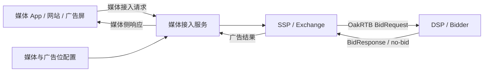
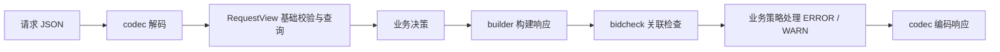

# OakRTB

[](https://github.com/oakrtb/oakrtb/actions/workflows/ci.yml)
[](LICENSE)

**面向 SSP、Exchange 和 DSP 的 OpenRTB 协议定义与 Java、Go、Rust SDK。**

OakRTB provides OpenRTB-aligned protocol definitions and SDKs for Java, Go, and Rust, with typed models, JSON/Protobuf encoding, builders, query views, and bid validation.

OakRTB 是实时广告竞价系统共用的协议基础库。它将请求与响应模型、编解码和校验规则集中维护，帮助供给方与买方完成协议接入，并减少多语言实现中的字段映射、数据语义和检查规则差异。

通过 OakRTB，你可以构建竞价请求、解析买方响应、查询广告展示机会、检查出价与请求是否匹配，也可以直接使用 JSON Schema 和 OpenAPI 接入其他语言的服务。

当前项目版本为 **0.2.0**，字段与对象语义对齐 **OpenRTB 2.6-202606**，HTTP 版本头使用 `x-openrtb-version: 2.6`。OakRTB 是独立项目，并非 IAB Tech Lab 官方产品；标准来源与署名见 [NOTICE](NOTICE)。

[项目定位](#项目定位) · [快速开始](#快速开始) · [接入指南](docs/getting-started.md) · [完整示例](examples/README.md) · [SDK 架构](docs/sdk.md) · [协议规范](docs/spec.md)

## 项目定位

OakRTB 聚焦于**竞价系统之间的协议交互**，作为应用中的依赖库使用。协议定义描述双方交换什么数据，SDK 帮助应用构建、读取和检查这些数据，业务系统据此执行广告选择与拍卖决策。

典型接入链路如下；媒体接入服务、SSP 和 Exchange 可以根据业务规模合并部署，也可以分别建设：



OakRTB SDK 可被接入服务、SSP、Exchange 或 DSP 嵌入使用。图中的节点代表业务职责，仓库本身不部署这些服务。

媒体设备通常只提供广告位标识和本次展示环境。接入服务读取媒体、广告位及竞价策略配置，合并设备信息后组装完整请求。因此，设备侧广告接口与服务端竞价协议可以分别演进；上图中的媒体接入接口需要由业务系统定义。

| 层次 | OakRTB 提供 | 接入方负责 |
|---|---|---|
| 协议与模型 | JSON Schema、OpenAPI、protobuf 定义及生成模型 | 确定双方支持的字段、扩展和交易约定 |
| 报文处理 | Builder、JSON codec、请求/响应查询视图 | HTTP 收发、鉴权、压缩、路由与超时控制 |
| 校验与诊断 | 基础校验、格式就绪、完整 JSON 合同及竞价关联检查 | 根据诊断结果执行接受、拒投或降级策略 |
| 媒体接入 | 承载媒体、设备、库存和隐私信号的协议对象 | 配置后台、设备信息采集、隐私策略和数据补全 |
| 广告业务 | 承载出价、素材与通知地址的响应对象 | 广告选择、预算、拍卖执行、渲染、通知及结算 |

## 适用场景

- **SSP / Exchange 对接买方**：构建网站、应用和数字户外库存的竞价请求，读取买方出价并检查请求关联、底价和交易约束。
- **DSP 接入供给方**：解析请求，查询展示位与格式信息，将业务决策转换为出价或结构化 no-bid 响应。
- **媒体接入服务组装报文**：将后台媒体配置、广告位配置与设备现场信息映射为统一的 BidRequest。
- **协议联调与回归验证**：使用 JSON 样例、Schema 和诊断结果检查报文，通过共享测试数据验证三语言行为。

如果你需要一套可直接运营的 SSP 后台、广告投放系统或移动端广告渲染 SDK，这些业务能力需要在 OakRTB 协议层之上建设。

## 设计重点

- **同一份模型定义**：三种语言从共享 protobuf 定义生成强类型模型，JSON 与 protobuf 编码进入同一套构建、查询与检查流程。
- **校验职责分开**：基础结构、广告格式就绪、完整 JSON 合同和请求—响应关系分别检查，调用方按处理阶段选择。
- **数据语义明确**：区分数值字段缺失与显式零值，通过 codec 处理 OpenRTB JSON 与模型中的 `ext` 表示差异。
- **诊断与决策分开**：SDK 返回 ERROR / WARN 等发现项，业务系统决定如何处理；校验通过不代表已经完成广告准入或竞价选优。
- **示例与实现一起验证**：仓库维护可运行的三语言接入示例，以及全字段、非法报文和跨语言一致性测试数据。

## 主要能力

| 能力 | 内容 |
|---|---|
| 协议对象 | BidRequest、BidResponse、Imp、SeatBid、Bid 及其子对象 |
| 广告形态 | Banner、Video、Audio、Native；内嵌 Native 请求的 Schema 校验 |
| 库存上下文 | Site、App、DOOH，以及设备、用户、内容、供应链与隐私信号 |
| 编解码 | OpenRTB JSON 与可选 protobuf 二进制编码，共用强类型模型 |
| 构建与查询 | 流式 Builder、请求/响应 View、按 ID 和格式查询、字段摘要 |
| 校验 | 模型基础检查、格式就绪检查、完整 JSON Schema 校验 |
| 竞价检查 | 请求与响应 ID、展示位、markup 类型、底价、屏蔽项及 PMP Deal 约束 |
| 一致性 | 显式零值与缺失值区分、`ext` 转换及跨语言共享测试 |

OakRTB 定义了比 OpenRTB 基础要求更严格的校验约束，例如请求必须显式提供 `at`、`cur`。接入已有 OpenRTB 流量时，应先核对 [协议必填规则](docs/spec.md#必填规则)。具体 JSON 合同以 [JSON Schema](schema/jsonschema/) 为准。

## 快速开始

克隆仓库后，选择一种语言运行即可。下面的示例使用本地 SDK 源码，不依赖 OakRTB 是否已发布到公共包仓库。

```sh
git clone https://github.com/oakrtb/oakrtb.git
cd oakrtb
```

### Go

需要 Go 1.25 或更高版本：

```sh
(cd sdk/go && go run ../../examples/go/main.go)
```

源码：[examples/go/main.go](examples/go/main.go)。

### Java

需要 JDK 21 和 Maven：

```sh
mvn -f sdk/java/pom.xml package -DskipTests
java --class-path "sdk/java/target/oakrtb-sdk-$(cat VERSION)-all.jar" examples/java/AuctionExample.java
```

源码：[examples/java/AuctionExample.java](examples/java/AuctionExample.java)。

### Rust

需要 Rust 1.88+，建议使用当前 stable 工具链，并确保 `protoc` 在 `PATH` 中：

```sh
cargo run --locked --manifest-path examples/rust/Cargo.toml --target-dir sdk/rust/target
```

源码：[examples/rust/src/main.rs](examples/rust/src/main.rs)。

三个程序均模拟 **SSP 构建请求 → DSP 校验与出价 → SSP 解析响应**，依次验证以下结果：

| 场景 | 预期 |
|---|---|
| 出价 2 CPM，底价 1 CPM | 返回出价，`no_bid=false` |
| 出价 0.5 CPM，底价 1 CPM | 产生低价 WARN，按示例策略返回 no-bid |
| 没有候选广告 | 返回结构化 no-bid |

程序会输出请求、响应和拒投诊断，执行过程中不发送网络竞价请求。初次构建需要下载依赖。项目集成方式见 [接入指南](docs/getting-started.md)，示例说明见 [examples/README.md](examples/README.md)。

## SDK 使用流程



完整 JSON Schema 校验由 `jsonschema` 独立提供，可用于接入边界、联调和离线校验。protobuf 输入使用各语言的原生 protobuf 解码方法，随后进入同一套 View 与竞价检查流程。

| 模块 | 使用时机 |
|---|---|
| `codec` | 在 JSON 报文与生成模型之间转换 |
| `builder` | 构建请求、展示位、出价及响应 |
| `view` | 基础校验后，按 ID、格式或摘要读取模型 |
| `validation` | 单独执行基础检查、格式就绪检查，或读取诊断类型 |
| `bidcheck` | 检查响应是否符合原请求的关联与竞价约束 |
| `jsonschema` | 按完整 JSON 合同校验原始报文 |

`CheckResult.OK/ok` 表示没有 ERROR；WARN 仍需业务处理。示例采用“任意 WARN 都拒投”的策略，SDK 本身不会自动执行该策略。完整响应检查应使用 `bidcheck.Response/response`，以获得币种和席位上下文。

## 仓库结构

```text
oakrtb/
├── schema/jsonschema/  JSON 合同与 Native 校验规则
├── proto/             共享模型和 protobuf 定义
├── openapi/           HTTP 接口合同
├── sdk/               Java、Go、Rust SDK
├── examples/          JSON 报文与可运行接入示例
├── testdata/          全字段、非法报文及跨语言一致性测试数据
├── scripts/           校验、同步检查与架构检查工具
└── docs/              协议、接入、架构和发布文档
```

SDK 内的 schema/proto 副本用于独立构建和打包；根目录保存权威定义。修改协议后通过 `make sync-schemas` 同步，修改 proto 后再执行 `make proto-go` 更新已提交的 Go 模型。

## 开发与验证

完整仓库检查需要 Python 3.10+、Go 1.25+、JDK 21、Maven、Rust 1.88+ 和 `protoc`。CI 的 Python 版本为 3.12。

```sh
python3 -m pip install -r scripts/requirements.txt
make validate
make proto-check
make sdk-test
```

也可以单独运行 `make sdk-test-go`、`make sdk-test-java` 或 `make sdk-test-rust`。CI 同时执行协议副本检查、SDK 架构检查、测试和三种语言的接入示例。

## 文档导航

| 想了解什么 | 文档 |
|---|---|
| 将 SDK 接入现有项目 | [接入指南](docs/getting-started.md) |
| 运行和修改完整示例 | [示例说明](examples/README.md) |
| 模块依赖、数据语义与 API 迁移 | [SDK 架构](docs/sdk.md) |
| View 查询与竞价检查 | [View 使用](docs/view-usage.md) |
| 对象、字段和协议约束 | [协议规范](docs/spec.md)、[对象说明](docs/objects.md) |
| HTTP、编码、压缩与状态码 | [传输约定](docs/transport.md)、[OpenAPI](openapi/openrtb.yaml) |
| 版本和发布 | [版本策略](docs/versioning.md)、[发布指南](docs/publishing.md)、[变更记录](CHANGELOG.md) |

## 贡献与许可

提交问题或改进前请阅读 [贡献指南](CONTRIBUTING.md)。安全问题按 [SECURITY.md](SECURITY.md) 报告。

代码与 Schema 使用 [Apache License 2.0](LICENSE)。OpenRTB 对象与字段的来源、许可及署名见 [NOTICE](NOTICE)。
