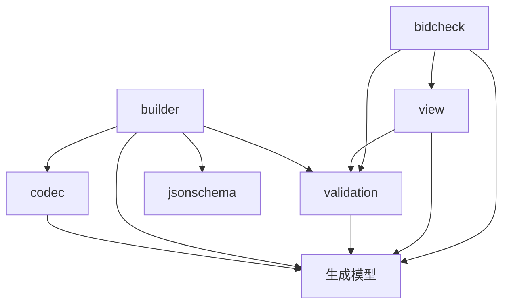

# SDK 架构与使用

首次接入请先阅读 [接入指南](getting-started.md)；可运行程序见 [完整示例](../examples/README.md)。

Go、Java、Rust 使用同一份 `proto/oakrtb/v2/openrtb.proto` 生成强类型模型。JSON 和 protobuf 是模型的两种编码方式；构建器、视图与 BidCheck 不使用独立的 JSON 对象树作为业务模型。

## 模块职责与依赖

| 模块 | 职责 | 允许依赖的 SDK 模块 |
|---|---|---|
| 生成模型 | 字段、存在性、protobuf 消息 | 无业务模块；Rust serde 辅助代码属于模型层 |
| `codec` | 模型与 OpenRTB JSON 的双向转换 | 生成模型 |
| `validation` | 模型基础检查、格式就绪检查及共享 CheckResult/CheckIssue | 生成模型 |
| `builder` | 构造模型；提供编码、完整校验的便捷方法 | 模型、validation、codec、jsonschema |
| `view` | 创建查询视图、索引和字段摘要 | 模型、validation |
| `bidcheck` | 请求与响应之间的契合检查 | 模型、view、validation |
| `jsonschema` | 原始 JSON 的完整合同校验及 Report | 不依赖 builder/view/bidcheck |

箭头表示“依赖”，不是调用顺序：



`builder → view → bidcheck` 只是本地构造请求时的一种流程，不能用作架构层级。收到外部请求时从 codec 开始，无需经过构建器。

## 入站适配：双格式、单模型

| 语言 | JSON 解码 | protobuf 解码 | 查询入口 |
|---|---|---|---|
| Go | `codec.UnmarshalBidRequest` | `proto.Unmarshal` | `view.NewRequest(req)` |
| Java | `codec.Json.parseBidRequest` | `BidRequest.parseFrom` | `RequestView.of(req)` |
| Rust | `codec::parse_bid_request` | `BidRequest::decode`（prost） | `RequestView::new(&req)` |

响应使用对应的 BidResponse / ResponseView 入口。codec 负责语法和类型；view 创建时调用一次基础校验。只需校验、不需视图时，可直接使用 Go/Rust 的 `validation.Request` / `validation::request`，或 Java 的 `BasicValidation.validateRequest`。

典型流程：

```text
接收 JSON/protobuf → codec/原生 protobuf 解码 → 强类型 BidRequest
    → RequestView（基础校验）→ 业务决策
    → builder（强类型 BidResponse）→ 可选 BidCheck.response → codec/原生 protobuf 编码
```

Schema 是独立的完整合同校验能力，输入原始 JSON 字节；按边界策略或离线工具需求选择。`BuildValidated` / `buildValidated` / `build_validated` 是便利组合，不代表核心构建操作必须执行 schema 校验。

## 三语言一致的数据约定

- 单值 `int32` / `double` 使用 proto optional。缺失与显式零值不同；JSON/protobuf 往返保留 `gdpr:0`、坐标零值、`nbr:0`。`mtype` 的枚举零值仍表示未指定。
- JSON 字段名采用协议原名，枚举为数字；数值字段不接受数字字符串、NaN 或 Infinity。可表示为 int32 的整值数字（如 `1.0`）允许解码。
- JSON `null` 字段按缺失处理；消息根必须是对象，数组元素不得用 null 代替模型或标量。
- Rust JSON 解析保留任意精度的扩展数字；int32 使用十进制精确判断整数性与范围，不经过 f64。
- 未知字段会被忽略。扩展数据应放入 `ext`。
- JSON 中的 `ext` 必须是对象，可含任意嵌套数据。为兼容现有 protobuf wire，模型的 `ext` 仍存 JSON 对象字符串；codec 双向转换且不解释扩展对象内部的字段。不要用原生 ProtoJSON 替代 OpenRTB codec。
- 基础校验要求 imp.id 在请求内唯一，Deal ID 在展示位内非空且唯一；Deal 底价必须有限且非负，固定价 Deal 必须给出价格。基础校验限制请求 at 为 1、2 或 ≥500（3 仅用于 Deal），并检查 id、at、cur、imp、库存互斥及响应出价结构；价格必须为有限正数。Banner 尺寸、mimes 等格式就绪规则统一由 validation 实现，构建器复用；完整 schema 约束不在基础校验中重复实现。
- BidCheck 的 `OK/ok` 表示没有 ERROR。底价、屏蔽、超时等 WARN 不自动拒绝响应。`REQUEST_ID_MISMATCH` 对出价与 no-bid 均生效。
- BidCheck 的币种、域名、bundle、类别比较统一采用 ASCII 大小写归一化，不额外执行 Unicode/IDNA 转换。币种和 bid.bundle 去除首尾空白；屏蔽列表条目保持原值。

这些约定由 `testdata/conformance/cases.json` 驱动三语言测试，覆盖模型 → protobuf → JSON 往返、解码拒绝、基础校验、格式就绪和竞价检查结果。

## 私有交易检查

`bidcheck.Response/response` 检查 private_auction 必须携带 dealid，任何携带的 dealid 都必须在对应 Imp 的 PMP 列表内。未知或缺失 Deal、席位白名单不符、广告主域名白名单不符返回 ERROR；域名比较采用 ASCII 大小写归一化，所有给出的 adomain 均须被允许，配置白名单但响应无域名也拒绝。

匹配到 Deal 后，显式 Deal.bidfloor（包括零）覆盖 Imp 底价，并使用 Deal.bidfloorcur；未提供 Deal 底价时沿用 Imp 底价及币种。只有双方币种非空且匹配时比较数值，币种不同时给出 FLOOR_CUR_DIFF 警告，不进行兑换。低于一般 Deal 底价沿用 PRICE_BELOW_FLOOR/WARN；Deal.at=3 时价格必须等于固定价，否则 DEAL_PRICE_MISMATCH/ERROR。

单条 `bidcheck.Bid/bid` 缺少响应币种及 seat 上下文，跳过价格比较和席位白名单检查；需要这两项检查时使用完整响应入口。

## 视图所有权

`RequestView` / `ResponseView` 表示查询视图，不承诺深拷贝。

- Go：`NewRequest/NewResponse` 借用模型；模型、视图及其返回的指针与切片在使用期间必须保持只读。需要随后修改原始模型时使用 `NewRequestCopy/NewResponseCopy`。复制期间不得并发修改输入。
- Java：生成的 protobuf 消息不可变，视图列表不可变；修改原 builder 不影响已构建的消息。
- Rust：视图借用 `&BidRequest` / `&BidResponse`，借用检查器约束原始模型的修改。视图持有模型引用，避免热路径 JSON 重解析。

## Builder 与完整校验

Go 的所有模型 Builder 在 Build 时深拷贝结果，已构建模型不受后续构建器、传入子对象或其他构建结果的修改影响。构建期间不得并发修改输入。Java 模型不可变，Rust build 消费构建器。

Builder 的 `Build/build` 输出强类型模型，`BuildJSON/buildJson/build_json` 委托 codec 编码。

Go 的完整校验返回 JSON、Report、error；Java/Rust 返回 `ValidatedPayload`（JSON 字节与 Report）。必须检查 Report 是否通过，不能仅凭构建未抛错就认定完整 schema 有效。

Rust 默认启用 `jsonschema` feature；只使用模型、codec、builder、validation、view、bidcheck 时可配置：

```toml
oakrtb-sdk = { version = "0.2.0", default-features = false }
```

此时不编译 jsonschema 依赖，`jsonschema`、`ValidatedPayload`、`build_validated` 不可用。生成的模型仍依赖 prost，并在构建时需要 protoc；这是统一模型的基础依赖。

## 本次模块与职责调整

模块从 `build` → `builder`、`fit` → `bidcheck`、`schema` → `jsonschema`，三语言同步调整导入路径；不保留旧目录的转发副本。这是 SDK 源码 API 变更，不修改协议字段、JSON Schema 文件名、HTTP 合同或 protobuf wire。

- Java `Fit` 改为 `bidcheck.BidCheck`。
- `FitResult/FitIssue` 改为 `validation.CheckResult/CheckIssue`；严重级别及稳定诊断码也由 validation 统一管理。Go 的 `Code*`、Java 的 `IssueCode`、Rust 的 `CODE_*` 从 validation 导入。
- 格式就绪检查直接接收生成的 Imp 模型：Go `validation.ImpReadyMtype(imp, mtype)`，Java `Readiness.impReady(imp, mtype)`，Rust `validation::imp_ready_mtype(&imp, mtype)`。
- 检查所有已提供格式：Go `validation.ImpReady(imp)`，Java `Readiness.impReady(imp)`，Rust `validation::imp_ready(&imp)`。Builder 拒绝 ERROR，WARN 保留为可查询提示。
- bidcheck 仅负责请求与响应的关联及竞价约束；格式就绪检查由调用方按需要独立执行。
- Rust feature `schema` 改为 `jsonschema`，仍默认开启；`default-features = false` 可关闭。
- jsonschema 的 `Report` 保持 JSON 合同校验及 HTTP 错误响应结构；不与含 WARN 的 `CheckResult` 混用。

## 统一视图入口

三语言统一通过主视图工厂执行基础校验并构造完整视图：Go `NewRequest/NewResponse`，Java `RequestView.of/ResponseView.of`，Rust `RequestView::new/ResponseView::new`。主视图内部状态封装，不再提供分步组装 API。

- 展示位、出价和席位子视图为独立的 `ImpView`、`BidView`、`SeatBidView`。
- Java 删除复数 Views 工具类；三语言全部删除 Pipeline、Snapshot 及运行/轻量校验兼容入口。基础校验直接调用 validation，视图构造也会自动执行。
- 删除 SharedView 中间层；公共查询直接从主视图调用，原始字段通过 `request()` / `response()` 访问。
- 格式转换归属 markup：Go `MarkupFromImp/MarkupFromMtype`，Java `MarkupMask.fromImp/fromMtype`，Rust `MarkupMask::from_imp/from_mtype`。
- 截止时间在创建请求视图时固定；响应分组与扁平列表共享 BidView 存储。Java 使用不可变列表，Rust 返回只读切片，Go 返回借用切片并要求调用方只读使用。

## API 迁移

| 旧入口 | 新入口 |
|---|---|
| Go `build.MarshalJSON/UnmarshalBidRequest/UnmarshalBidResponse` | 同名 `codec` 方法 |
| Java `build.Json` | `codec.Json`；原 `request/response` 校验改用 `Schema` |
| Go `RunRequest/RunResponse` | `NewRequest/NewResponse` |
| Go `RunRequestCopy/RunResponseCopy` | `NewRequestCopy/NewResponseCopy` |
| Java `RequestPipeline.run/ResponsePipeline.run` | `RequestView.of/ResponseView.of` |
| Rust `run_request/run_response(&Value)` | codec 解码为模型，再 `RequestView::new/ResponseView::new` |
| `LightGate` | `validation` 基础校验；创建 View 时自动调用 |
| Go `Shared` 字段 / Rust `shared` 字段 | 主视图查询方法；原始字段从 `Request()/request()` 或 `Response()/response()` 读取 |
| Go `Imps/SeatBids/Bids` 字段 | `Imps()/SeatBids()/Bids()` 方法 |
| Rust `imps/seatbids/bids` 字段 | 同名只读切片访问方法 |
| `Snapshot` | `RequestView/ResponseView` |
| Rust `ValidatedJson` | `ValidatedPayload` |

builder 编解码/Schema 转发方法、Java builder.Json、Rust ValidatedJson 及三语言旧视图入口均已删除，须迁移至新入口。Rust Builder、View、BidCheck 的 JSON Value 接口是源码破坏性变更，不隐式地在热路径转换 Value；原 JSON 通过 codec 在边界解码，模型构造使用 `proto` 类型。

Go 直接构造 optional 字段使用 `proto.Int32(0)` / `proto.Float64(0)`，通过指针 nil 判断存在性；Java 使用 `hasX/clearX`；Rust 使用 `Some(0)/None`。旧版模型转发 protobuf 时仍可能丢弃显式零值，需要端到端升级。

## 协议源与生成产物

JSON Schema 是 JSON 校验权威；proto 定义共享模型和二进制编码；OpenAPI 描述 HTTP 合同。

修改根目录 schema/proto 后执行 `make sync-schemas`；修改 proto 还需 `make proto-go`。`make check-copies` 与 SDK 测试入口只读检查副本，发现不一致即失败。`scripts/check_architecture.py` 检查模块依赖边界，防止职责重新混入。

运行 `make validate proto-check sdk-test`。Java 需要 JDK 21，Rust 需要 protoc。安装与发布见 [publishing.md](publishing.md)，协议传输见 [transport.md](transport.md)，使用示例见 [view-usage.md](view-usage.md)。
